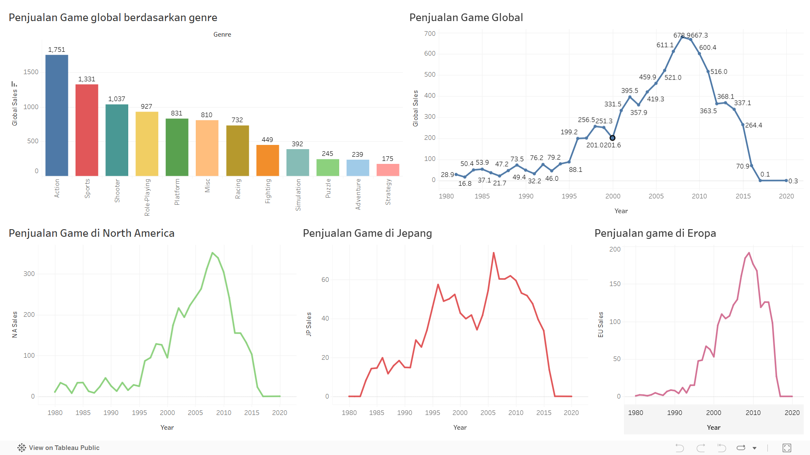

# 🎮 Video Game Sales Dashboard (Streamlit)

Dashboard interaktif berbasis **Streamlit** untuk mengeksplorasi dan memprediksi penjualan video game global.  
Proyek ini menggunakan dataset `vgsales` dan model machine learning dengan algoritma Random Forest yang sudah dilatih (`video_game_sales.pkl`) untuk memprediksi **Global_Sales** berdasarkan penjualan per region.

---
## Tableau Dashboard

---

## ✨ Fitur Utama

- **Dashboard interaktif** dengan tema dark–neon bertema video game.
- **Filter dinamis**:
  - Rentang tahun
  - Genre game
- **Visualisasi:**
  - Bar chart penjualan global berdasarkan genre
  - Line chart tren penjualan global per tahun
  - Line chart tren penjualan per region (NA, EU, JP)
- **Fitur Prediksi**:
  - Memanfaatkan model `video_game_sales.pkl` (Random Forest)
  - Input: `NA_Sales`, `EU_Sales`, `JP_Sales`, `Other_Sales`
  - Output: prediksi `Global_Sales` (dalam juta kopi)
- Tampilan gambar referensi dashboard Tableau: `assets/vgsales_dashboard.png`
